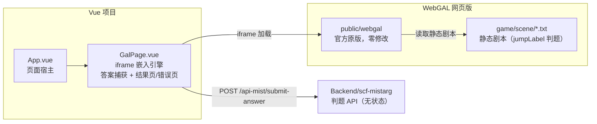

# mistarg2anns — WebGAL × Vue 游戏宿主页（不魔改版）

游戏页面：宿主（iframe 嵌入引擎）+ 后端判题 API。
页面本身即游戏宿主，无集成测试 UI，无 mock 后端。
后端仅提供纯 API（`Backend/scf-mistarg/src/app.js`，腾讯云 SCF Web 函数，无状态）。

## 架构



核心：剧本全部由静态文件承载（引擎内 `jumpLabel` 判题）；后端只负责 API 判题反馈；
提交答案后宿主展示 ✅/❌ 结果页；后端不可达时展示网络错误页。

## 目录说明

| 路径 | 说明 |
|---|---|
| `webgal-game/` | 仓库自维护的游戏内容（config.txt / start.txt / scene/*.txt / flowchart.json） |
| `public/webgal/` | 生成物（gitignore）：官方网页版发行包 + webgal-game 覆盖，由 `fetch:webgal` 拉取 |
| `scripts/fetch-webgal.mjs` | 从 GitHub Releases 拉取官方发行包（非源码），dev/build/preview 前自动执行 |
| `public/webgal/game/scene/start.txt` | 引擎固定入口（4.6.4 版从 scene 目录启动），仅一句 `changeScene:entry.txt;` |
| `src/components/GalPage.vue` | iframe 宿主：答案捕获 + 判定结果页 + 网络错误页 |
| `vite.config.js` | `/api-mist` 代理（API_SCF_TARGET） |
| `../Backend/scf-mistarg/src/app.js` | 后端判题 API（腾讯云 SCF Web 函数，无状态） |

注：

- 引擎本体不下源码、不入库：`public/webgal/` 是官方 Release 的 web 构建产物，
  首次运行 dev/build/preview 时自动拉取（约 71 MB），版本由 package.json 的
  `webgalVersion` 固定；手动强制刷新：`pnpm fetch:webgal -- --force`
- `game/start.txt`（game 根目录）在本引擎版本中不是启动场景，已同步为同一句内容
- 版本未变时 `fetch:webgal` 会跳过覆盖：改了 `webgal-game/` 内容需同步
  `public/webgal/game/`，或用 `--force` 重拉

## 本地开发

1. 启动后端 API（可选，端口 9000，在 `Backend` 目录）：

   ```sh
   cd ../Backend
   node server.js --only mistarg     # 或 node dev.js --only mistarg（带热更新）
   ```

2. 启动前端（子项目内，端口与 `projects.json` 的 `devPort=5176` 一致）：

   ```sh
   pnpm dev
   ```

   打开 `http://localhost:5176/mistarg/2anns/`。

`.env.development` 配置 `API_SCF_TARGET=http://localhost:9000`、`API_SCF_REWRITE=true`；
后端未启动时游戏仍可玩（引擎内 `jumpLabel` 判题），但提交答案会显示「网络错误」页。
首次运行会自动拉取官方 WebGAL 发行包（GitHub Releases，约 71 MB，随后缓存跳过）；
网络受限时可用环境变量 `WEBGAL_RELEASE_URL` 指定镜像下载地址。

## 后端接口（Backend/scf-mistarg）

| 接口 | 作用 |
|---|---|
| `POST /api-mist/submit-answer?answer=xx` | 判题：触发式反馈 `{ ok, answerCorrect }`（无状态） |

后端对 `/api-mist`、`/scf-mistarg` 前缀做了兼容（带不带都能识别）；
无状态设计：不记录任何进度、不下发剧本；答案通过环境变量
`MISTARG_PUZZLE_ANSWER` 注入（默认 `42`）。

## 游戏流程

1. 引擎标题页点击开始 → 启动场景 `scene/start.txt` 仅一句跳转 `entry.txt`
2. 剧本全部来自 `game/scene/` 静态文件：`choose` 选左右路 → `puzzle.txt`
3. `puzzle.txt` 内 `getUserInput` 采集答案，宿主捕获后 `POST /api-mist/submit-answer`
4. 后端返回判定（无状态）→ 结果页展示 ✅/❌ → 点击返回后重载引擎，重新进入开场
5. 后端不可达：提交后展示「网络错误」页，可重试或返回游戏

## 与正式后端对接

- `/api-mist` 前缀与 `projects.json` 的 `proxyApi` 对齐；`.env.development` 的
  `API_SCF_TARGET` 可改为线上 CVM/网关地址（`API_SCF_REWRITE` 按部署方是否剥前缀而定）
- 跨域部署时后端需允许前端站点 origin（CORS），app.js 已带 `Access-Control-Allow-Origin`

## 已知限制（不魔改的固有代价，均经实测）

- `choose` 选项目标不能是完整 URL：解析器按「:」截断（4.6.4 实测），只能本地场景名
- `changeScene` 不做 `{变量}` 插值（4.6.4 实测）：变量进不了 URL，答案由宿主中转
- 引擎启动场景固定为 `game/scene/start.txt`（本版本行为）
- 每次交互 = 一次场景切换，有轻微加载感
- 答案等数据走 GET query，仅测试用；正式接入敏感信息请改用后端 Cookie + getUserInput 登录

